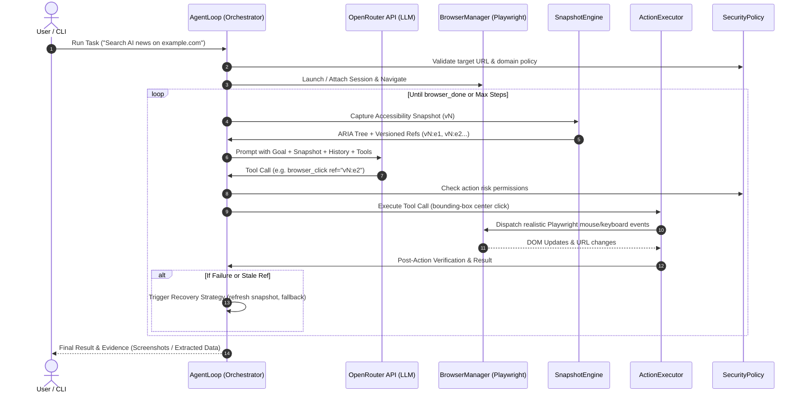

# BrowserAgent: Autonomous LLM-Driven Web Automation

[](https://www.typescriptlang.org/)
[](https://playwright.dev/)
[](https://openrouter.ai/)
[]()
[](LICENSE)

An enterprise-grade autonomous web automation agent built upon the research specifications in [deep-research-report.md](./deep-research-report.md). BrowserAgent bridges LLMs (via the **OpenRouter API**) with modern browser automation (**Playwright**) using **Semantic Accessibility Snapshots** and **Bounding-Box Coordinate Clicks**.

---

## 🌟 Core Architecture & Key Features

### 1. Semantic Accessibility Snapshots
Instead of passing raw, token-heavy HTML or relying on brittle CSS/XPath selectors, the agent extracts a compact **ARIA Accessibility Tree**. Every interactive element is tagged with a unique, version-scoped reference identifier:
```yaml
PAGE TITLE: "Example Store"
SNAPSHOT VERSION: v1
INTERACTIVE ELEMENTS:
  - textbox "Search query" [ref=v1:e1, placeholder="Search products..."]
  - button "Search" [ref=v1:e2]
  - link "Cart (0)" [ref=v1:e3]
```

### 2. Bounding-Box Coordinate Clicks
To mimic human interactions faithfully and bypass fragile synthetic DOM events, clicks are executed by mapping the element's `ref` to its Playwright locator, computing its real viewport bounding box, and dispatching mouse clicks at its center:
$$\text{clickX} = \text{box.x} + \frac{\text{box.width}}{2}, \quad \text{clickY} = \text{box.y} + \frac{\text{box.height}}{2}$$

### 3. OpenRouter API Integration
Natively integrates with OpenRouter (`https://openrouter.ai/api/v1`), allowing you to plug in any state-of-the-art reasoning model:
- `anthropic/claude-3.5-sonnet` (Recommended default)
- `google/gemini-2.0-flash-001`
- `openai/gpt-4o`
- `deepseek/deepseek-chat`

### 4. Self-Healing & Stale Reference Recovery
Web pages are dynamic. BrowserAgent incorporates snapshot versioning (e.g. `v1:e5` $\to$ `v2:e5`):
- **Stale Ref Detection:** If an agent targets an element from a prior snapshot version, the system catches the mismatch, provides actionable diagnostic feedback, and refreshes the snapshot safely.
- **Anti-Repetition Heuristics:** Detects if the agent is stuck repeating the exact same failing action and injects strategic recovery hints (scroll, wait, keyboard fallback).
- **Post-Action Verification:** Confirms whether clicks triggered URL changes, modal dialogues, or DOM mutations.

### 5. Security & Session Layer
- **Domain Whitelisting (`allowedDomains`):** Restricts navigation to authorized domains or subdomains to prevent SSRF and unwanted external redirections.
- **Credential & Secret Masking:** Automatically redacts Authorization Bearer tokens, API keys, and passwords from logs and prompts.
- **Session Persistence:** Supports `--session <id>` to persist and restore authentication states (cookies and localStorage) between runs.

---

## 🏗 System Architecture Flow



---

## 🚀 Quickstart

### 1. Prerequisites
- **Node.js**: v20+ or v24+
- **OpenRouter API Key**: Obtain one from [openrouter.ai](https://openrouter.ai)

### 2. Installation
```bash
# Clone the repository
git clone <repo-url>
cd agent

# Install dependencies
npm install

# Install Playwright browser binaries (Chromium)
npx playwright install chromium
```

### 3. Configure Environment
Create a `.env` file from `.env.example`:
```bash
cp .env.example .env
```
Edit `.env` and set your key:
```ini
OPENROUTER_API_KEY=sk-or-v1-your-key-here
OPENROUTER_MODEL=anthropic/claude-3.5-sonnet
ALLOWED_DOMAINS=*
HEADLESS=true
```

---

## 💻 CLI Usage

The agent CLI provides two primary commands: `run` and `snapshot`.

### Run Autonomous Agent
```bash
# Autonomous search and summarize task
npx tsx bin/agent.ts run "Search for latest AI agent news and summarize top 3 headlines" --url "https://news.ycombinator.com"

# Visible/headful browser mode (watch the agent click and type live!)
npx tsx bin/agent.ts run "Find the documentation for Playwright locators" --url "https://playwright.dev" --no-headless

# Use persistent session storage (cookies/logins preserved)
npx tsx bin/agent.ts run "Check notification inbox" --url "https://github.com" --session my-github-profile

# Restrict agent to specific domain whitelist
npx tsx bin/agent.ts run "Explore articles" --url "https://example.com" --allowed-domains "example.com,*.example.com"

# Capture screenshots at each step
npx tsx bin/agent.ts run "Test checkout flow" --url "https://demo.store.com" --screenshot
```

### Inspect Page Accessibility Snapshot
Quickly inspect how BrowserAgent sees any page:
```bash
npx tsx bin/agent.ts snapshot https://news.ycombinator.com
```

---

## 🛠 Programmatic SDK Usage

You can embed `BrowserAgent` directly into your Node.js / TypeScript applications:

```typescript
import {
  BrowserManager,
  OpenRouterClient,
  SecurityPolicy,
  AgentLoop,
} from 'browser-agent';

async function main() {
  const browserManager = new BrowserManager({
    headless: true,
    sessionId: 'session-demo',
  });

  const openRouterClient = new OpenRouterClient({
    apiKey: process.env.OPENROUTER_API_KEY,
    model: 'anthropic/claude-3.5-sonnet',
  });

  const securityPolicy = new SecurityPolicy({
    allowedDomains: ['wikipedia.org', '*.wikipedia.org'],
  });

  const agent = new AgentLoop(browserManager, openRouterClient, securityPolicy);

  try {
    const result = await agent.run({
      goal: 'Find who created JavaScript and in what year',
      initialUrl: 'https://en.wikipedia.org/wiki/JavaScript',
      maxSteps: 10,
      onStep: (step) => {
        console.log(`[Step ${step.stepNumber}] ${step.toolName}: ${step.output}`);
      },
    });

    console.log('Result:', result.finalAnswer);
    console.log('Total Tokens Used:', result.totalTokens);
  } finally {
    await browserManager.close();
  }
}

main();
```

---

## 🧪 Testing

The repository includes a comprehensive unit and integration test suite:
- **`tests/SecurityPolicy.test.ts`**: Tests domain whitelisting, SSRF protections, dangerous tool execution blocks, and sensitive credential masking.
- **`tests/SnapshotEngine.test.ts`**: Verifies semantic ARIA tree generation, versioned reference assignment, and stale ref detection.
- **`tests/ActionExecutor.test.ts`**: Tests bounding-box coordinate calculations, typing, batch form filling, and post-action verification.
- **`tests/AgentIntegration.test.ts`**: Full autonomous multi-step browser agent loop test running against local mock HTML fixtures.

Run all tests:
```bash
npm test
```

Run TypeScript strict typecheck:
```bash
npm run typecheck
```

---

## 🐳 Docker Deployment

Run the agent in a reproducible container with Playwright and Chromium pre-configured:

```bash
# Build the container
docker build -t browser-agent .

# Run with your OpenRouter key
docker run --rm -it \
  -e OPENROUTER_API_KEY="your-api-key" \
  browser-agent run "Search AI breakthroughs" --url "https://news.ycombinator.com"
```

Or using Docker Compose:
```bash
docker compose run agent
```

---

## 📜 Tool Schema Reference

| Tool Name | Parameters | Description |
|---|---|---|
| `browser_navigate` | `url: string` | Safely navigates to a URL. |
| `browser_click` | `ref: string, button?: string, clickCount?: number` | Clicks element at bounding box center coordinates. |
| `browser_type` | `ref: string, text: string, clear?: boolean, pressEnter?: boolean` | Types text into input field. |
| `browser_fill_form` | `fields: Array<{ ref: string, value: string }>` | Fills multiple form fields in one batch. |
| `browser_hover` | `ref: string` | Hovers mouse over element center coordinates. |
| `browser_press_key` | `key: string` | Presses keyboard key (e.g. `Enter`, `Tab`, `Escape`). |
| `browser_select_option` | `ref: string, value: string` | Selects dropdown combobox option. |
| `browser_wait_for` | `ms?: number, text?: string` | Waits for delay or visible text. |
| `browser_snapshot` | *none* | Forces an immediate fresh accessibility snapshot. |
| `browser_done` | `summary: string, finalAnswer: string, sources?: string[]` | Concludes task with final answer. |

---

## 📄 License

MIT License. See [LICENSE](./LICENSE) for details.
