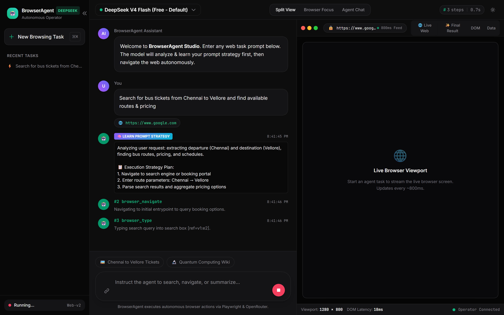
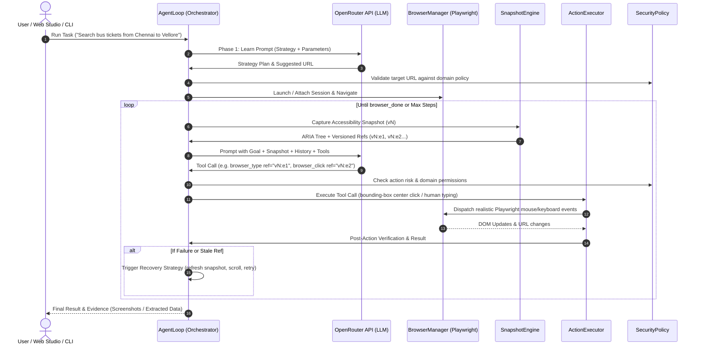
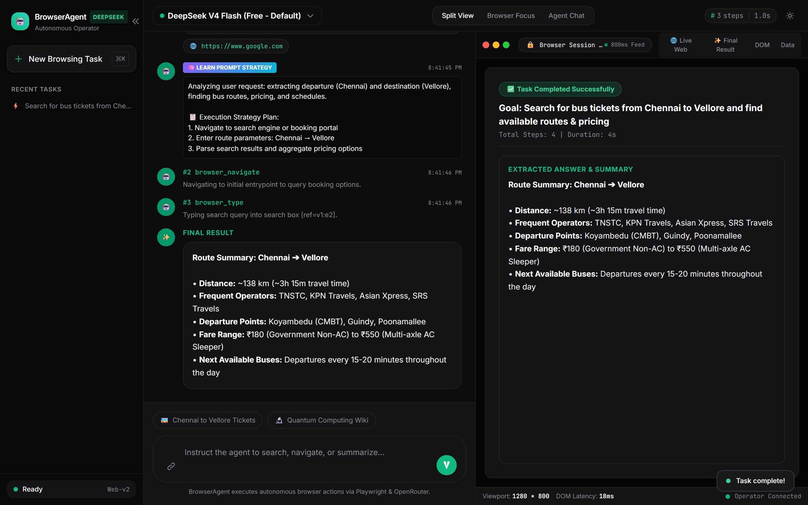

# BrowserAgent: Autonomous LLM-Driven Web Automation Studio

[](https://www.typescriptlang.org/)
[](https://playwright.dev/)
[](https://openrouter.ai/)
[]()
[](LICENSE)
[](https://github.com/karthi11040/browser-agent)

An enterprise-grade autonomous web automation agent and interactive web studio built upon the specifications in [deep-research-report.md](./deep-research-report.md). BrowserAgent bridges LLMs (via the **OpenRouter API**) with modern browser automation (**Playwright**) using **Semantic Accessibility Snapshots**, **Bounding-Box Coordinate Interactions**, and **Live Viewport Streaming**.

<p align="center">
  
</p>

---

## 🌟 Core Architecture & Key Features

### 1. 🖥 Interactive Web Studio Dashboard
Run the agent in a modern visual dashboard (`npm run ui`) featuring:
- **Live Viewport Streaming:** Real-time JPEG canvas updates (~800ms) with address bar synchronization.
- **Split & Focus Views:** Seamlessly toggle between Split View, Browser Focus, and Agent Chat.
- **Accessibility DOM Inspector:** Live inspection of the semantic ARIA tree as the agent navigates.
- **Task History & Quick Chips:** Persistent `localStorage` history for fast re-runs and one-click execution.
- **Live Model Switcher:** Switch between free models and frontier models on the fly.

### 2. 🧠 Prompt Learning & Strategy Formulation
Before executing browser actions, BrowserAgent engages a **Prompt Learning Phase** (`learn_prompt`). It deconstructs your goal into:
- Core understanding & intent extraction
- Extracted parameters & constraints
- Ordered step-by-step navigation strategy plan
- Suggested entrypoint URL

### 3. 🎯 Semantic Accessibility Snapshots
Instead of passing token-heavy, noisy raw HTML or relying on brittle CSS/XPath selectors, the agent extracts a compact **ARIA Accessibility Tree**. Every interactive element is tagged with a unique, version-scoped reference identifier:
```yaml
PAGE TITLE: "Example Store"
SNAPSHOT VERSION: v1
INTERACTIVE ELEMENTS:
  - textbox "Search query" [ref=v1:e1, placeholder="Search products..."]
  - button "Search" [ref=v1:e2]
  - link "Cart (0)" [ref=v1:e3]
```

### 4. 🖱 Bounding-Box Coordinate Clicks & Humanlike Input
To mimic natural human interactions and avoid synthetic JavaScript event detection:
- Clicks map an element's `ref` to its Playwright locator, compute its actual viewport bounding box, and dispatch real mouse clicks at its center:
  $$\text{clickX} = \text{box.x} + \frac{\text{box.width}}{2}, \quad \text{clickY} = \text{box.y} + \frac{\text{box.height}}{2}$$
- Text typing supports automatic clearing, realistic keystroke intervals, and optional Enter key dispatch.

### 5. 🌐 OpenRouter Multi-Model Support
Natively integrates with OpenRouter (`https://openrouter.ai/api/v1`), supporting both free and premium reasoning models:
- **Free Models (Default):**
  - `deepseek/deepseek-v4-flash-0731:free`
  - `qwen/qwen3.8-27b:free`
  - `google/gemma-4-26b-a4b-it:free`
  - `nex-agi/nex-n2.5-mini:free`
- **Frontier Models:**
  - `anthropic/claude-3.5-sonnet`
  - `openai/gpt-4o` / `openai/gpt-4o-mini`
  - `mistralai/mistral-large`

### 6. 🛡 Self-Healing & Stale Reference Recovery
Web pages are dynamic. BrowserAgent incorporates snapshot versioning (e.g. `v1:e5` $\to$ `v2:e5`):
- **Stale Ref Detection:** Catches references targeted from outdated page states, delivers actionable diagnostics, and requests a fresh snapshot.
- **Anti-Repetition Heuristics:** Detects loops or repeated action failures and injects recovery advice (scrolling, waiting, keyboard fallbacks).
- **Post-Action Verification:** Confirms whether clicks triggered URL transitions, modals, or DOM mutations.

### 7. 🔒 Security & Session Layer
- **Domain Whitelisting (`allowedDomains`):** Restricts navigation to authorized domains or wildcard patterns to prevent SSRF.
- **Credential & Secret Masking:** Automatically redacts Authorization Bearer tokens, API keys, and passwords from logs and prompts.
- **Session Persistence:** Supports `--session <id>` to persist and restore authentication states (cookies and localStorage) across tasks.

---

## 🏗 System Architecture Flow



---

## 🚀 Quickstart

### 1. Prerequisites
- **Node.js**: v20+ or v24+
- **OpenRouter API Key**: Get one for free at [openrouter.ai](https://openrouter.ai)

### 2. Installation
```bash
# Clone the repository
git clone https://github.com/karthi11040/browser-agent.git
cd browser-agent

# Install dependencies
npm install

# Install Playwright browser binaries (Chromium)
npx playwright install chromium
```

### 3. Configure Environment
Create your `.env` file from `.env.example`:
```bash
cp .env.example .env
```
Edit `.env` and provide your OpenRouter API key:
```ini
OPENROUTER_API_KEY=sk-or-v1-your-openrouter-key-here
OPENROUTER_MODEL=deepseek/deepseek-v4-flash-0731:free
ALLOWED_DOMAINS=*
HEADLESS=false
MAX_STEPS=20
SLOW_MO_MS=50
```

---

## 🖥 Launching the Web Studio Dashboard (`npm run ui`)

Launch the visual web dashboard with one simple command:

```bash
npm run ui
# or:
npm run dev
```

Open your browser at:
👉 **`http://localhost:3000`**

<p align="center">
  
</p>

### What You Can Do in the Web Studio:
- 🚀 **Natural Language Task Execution:** Enter any browsing goal with an optional starting URL.
- ⚡ **Quick Action Chips & History:** Preset task shortcuts and persistent `localStorage` history for instant re-runs.
- 🌐 **Live 800ms Viewport Feed:** Real-time visual canvas synchronized with the agent's browser navigation.
- 🧠 **Strategy & Step Inspector:** Review prompt understanding, execution strategy plans, bounding-box click coordinates, and thoughts.
- 🎯 **DOM Accessibility Tree:** Switch to the **DOM** tab to see the compact ARIA tree representation in real time.
- 📊 **Structured Final Answers:** Formatted summaries, source citations, and raw JSON artifacts in the **Data** tab.

---

## 💻 CLI Usage

You can also operate BrowserAgent directly from your terminal.

### Run an Autonomous Task
```bash
# Basic run with automatic strategy formulation
npx tsx bin/agent.ts run "Search for latest AI agent news and summarize top 3 headlines" --url "https://news.ycombinator.com"

# Visible/headed browser window with slow-motion execution
npx tsx bin/agent.ts run "Find the documentation for Playwright locators" --url "https://playwright.dev" --headed --slow-mo 200

# Persistent session storage (cookies/logins preserved)
npx tsx bin/agent.ts run "Check notification inbox" --url "https://github.com" --session my-github-profile

# Restrict agent to specific domain whitelist
npx tsx bin/agent.ts run "Explore articles" --url "https://example.com" --allowed-domains "example.com,*.example.com"

# Capture screenshots at each step
npx tsx bin/agent.ts run "Test checkout flow" --url "https://demo.store.com" --screenshot
```

### Inspect Page Accessibility Snapshot
Inspect the exact ARIA tree representation generated for any website:
```bash
npx tsx bin/agent.ts snapshot https://news.ycombinator.com
```

---

## 🛠 Programmatic SDK Usage

Embed BrowserAgent directly into your TypeScript/Node.js microservices or workflows:

```typescript
import {
  BrowserManager,
  OpenRouterClient,
  SecurityPolicy,
  AgentLoop,
} from './src/index.js';

async function main() {
  const browserManager = new BrowserManager({
    headless: true,
    sessionId: 'session-demo',
  });

  const openRouterClient = new OpenRouterClient({
    apiKey: process.env.OPENROUTER_API_KEY,
    model: 'deepseek/deepseek-v4-flash-0731:free',
  });

  const securityPolicy = new SecurityPolicy({
    allowedDomains: ['wikipedia.org', '*.wikipedia.org'],
  });

  const agent = new AgentLoop(browserManager, openRouterClient, securityPolicy);

  try {
    const result = await agent.run({
      goal: 'Find who created JavaScript and in what year',
      initialUrl: 'https://en.wikipedia.org/wiki/JavaScript',
      maxSteps: 10,
      onStep: (step) => {
        console.log(`[Step ${step.stepNumber}] ${step.toolName}: ${step.output}`);
      },
    });

    console.log('Result:', result.finalAnswer);
    console.log('Total Tokens Used:', result.totalTokens);
  } finally {
    await browserManager.close();
  }
}

main();
```

---

## 🧪 Testing & Validation

BrowserAgent is fully tested with unit and end-to-end integration test suites:
- **`tests/SecurityPolicy.test.ts`**: Tests domain whitelisting, SSRF protections, dangerous tool execution blocks, and credential masking.
- **`tests/SnapshotEngine.test.ts`**: Verifies semantic ARIA tree generation, versioned reference assignment, and element deduplication.
- **`tests/ActionExecutor.test.ts`**: Tests bounding-box coordinate calculations, typing, batch form filling, and DOM verification.
- **`tests/AgentIntegration.test.ts`**: Full autonomous multi-step browser agent loop running against local mock HTML fixtures.

Run all tests:
```bash
npm test
```

Strict TypeScript check:
```bash
npm run typecheck
```

---

## 🐳 Docker Deployment

Run the agent in a containerized environment with Playwright and Chromium pre-configured:

```bash
# Build the container
docker build -t browser-agent .

# Run container with your OpenRouter key
docker run --rm -it \
  -e OPENROUTER_API_KEY="your-api-key" \
  browser-agent run "Search AI breakthroughs" --url "https://news.ycombinator.com"
```

Or using Docker Compose:
```bash
docker compose run agent
```

---

## 📜 Tool Schema Reference

| Tool Name | Parameters | Description |
|---|---|---|
| `browser_navigate` | `url: string` | Safely navigates to a URL. |
| `browser_click` | `ref: string, button?: string, clickCount?: number` | Clicks element at bounding box center coordinates. |
| `browser_type` | `ref: string, text: string, clear?: boolean, pressEnter?: boolean` | Types text into input field with realistic keystrokes. |
| `browser_fill_form` | `fields: Array<{ ref: string, value: string }>` | Fills multiple form fields in one atomic batch. |
| `browser_hover` | `ref: string` | Hovers mouse over element center coordinates. |
| `browser_press_key` | `key: string` | Presses keyboard key (e.g. `Enter`, `Tab`, `Escape`). |
| `browser_select_option` | `ref: string, value: string` | Selects dropdown combobox option. |
| `browser_wait_for` | `ms?: number, text?: string` | Waits for a time duration or for visible text to appear. |
| `browser_snapshot` | *none* | Forces an immediate fresh accessibility snapshot. |
| `browser_done` | `summary: string, finalAnswer: string, sources?: string[]` | Concludes task with structured final answer. |

---

## 📄 License

MIT License. See [LICENSE](./LICENSE) for details.
