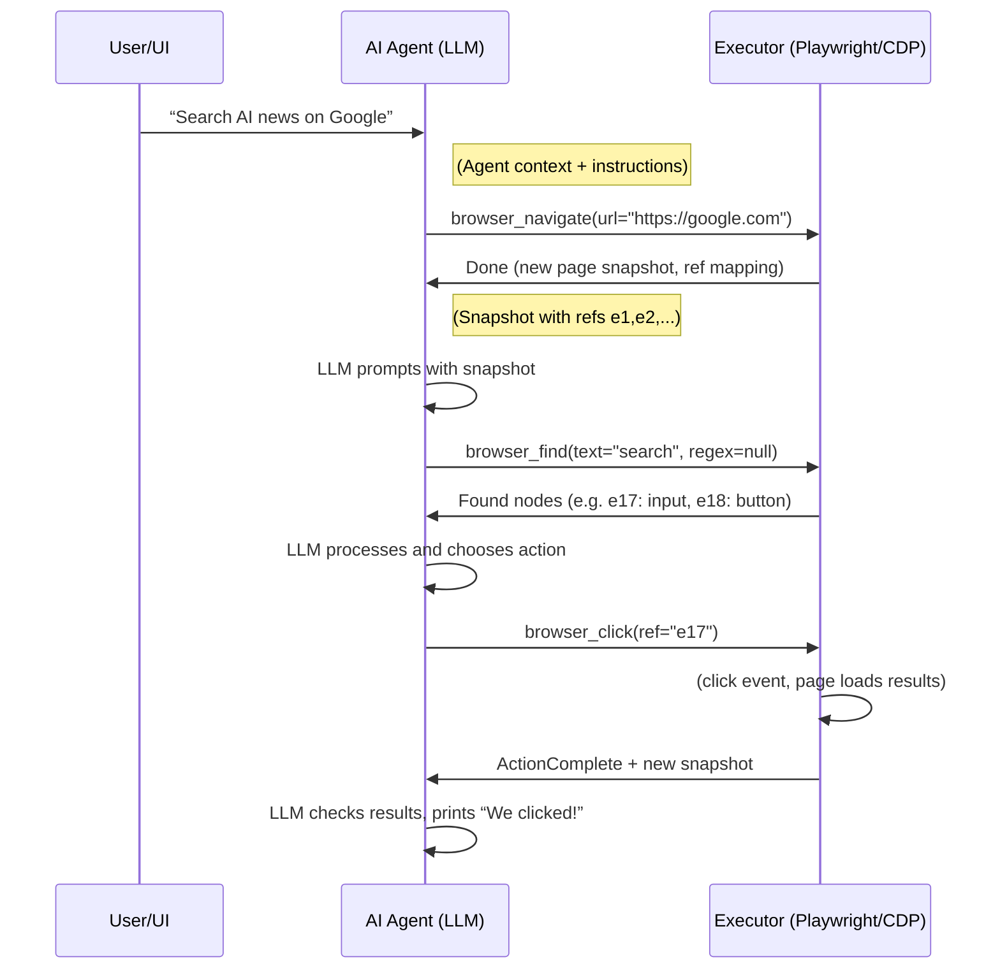

# Executive Summary  
Building an LLM-driven web automation agent hinges on combining structured page representations with a fixed “tool” interface for browser actions. Key patterns emerge from existing projects: web pages are captured as **accessibility snapshots** (trees of elements with roles, names, and unique `ref` IDs), which the LLM can reason over. The agent chooses actions (e.g. “click”) by referencing these `ref` identifiers in a well-defined JSON schema. The execution layer maps `ref`s to DOM nodes and performs actual clicks by computing element bounding boxes (x,y coordinates) and calling Playwright/Chrome APIs. Proper **versioning and verification** (e.g. tagging refs by snapshot version) ensures stale references fail safely. Error handling requires clear feedback: on a failed action the system returns an error (e.g. “Element not clickable”) and a fresh snapshot so the agent can adapt. Multiple implementations illustrate these ideas:

- **Playwright MCP** (Microsoft): a Node.js MCP server providing browser tools that operate on accessibility snapshots.  
- **Playwright** (Microsoft): the core browser automation library (JS/TS, Python, .NET) that underlies snapshotting and click execution.  
- **Agent-Browser** (Vercel Labs): a TypeScript CLI/daemon exposing both CLI and MCP interfaces for Chrome, including session persistence, authentication, and an “allowed domains” security layer.  
- **Browser Agent** (rkvalandas): a Python/Playwright agent framework with LLM-driven analysis, element mapping and recovery.  
- **Browserless** (browserless.io): a Node.js headless-browser service that offers MCP APIs and Docker deployment for parallel sessions.  
- **puppeteer-extra** (berstend): a plugin framework for Puppeteer that adds stealth and other features (used by some agents to avoid detection).  

By combining insights from these projects and research literature, we outline a roadmap: build a minimal Playwright/LLM loop using accessibility snapshots and ref-based clicks, then add robust session management, error recovery, and security checks. A prototype stack might use Playwright (JS or Python) plus an OpenAI or Claude API. Code snippets and diagrams below illustrate core flows (DOM snapshot → LLM → element `ref` → click → verify). Security considerations (e.g. remote-debugging exposure, user data privacy) are addressed with domain whitelisting, token encryption, and human-in-the-loop safeguards.   

# Identified Repositories and Documentation  
We identified and prioritized key open-source projects and official docs relevant to DOM→LLM→click agents. Official sources (Playwright and Microsoft) are primary; community tools (LangChain, agent browsers, etc.) supplement. A summary ranking of relevant projects:

- **Microsoft Playwright & Playwright MCP** – The core libraries and MCP server for structured DOM snapshots. Primary sources: [Playwright GitHub] and [Playwright MCP GitHub].  
- **Agent-Browser (Vercel Labs)** – An official LangChain-endorsed agent for Chrome (TypeScript). Implements CLI/MCP with session and auth management. (Emerging industry tool.)  
- **Browser Agent (rkvalandas)** – A Python agent using Playwright, supporting multiple LLMs and complex recovery strategies (MIT license).  
- **Browserless** – Headless browser platform (self-hosted/MCP server) for scaling sessions.  
- **puppeteer-extra** – Extends Puppeteer (Node) with plugins (e.g. stealth) that many agents use to bypass bot-detection (MIT license).  
- **Selenium-based Agents** – General category (e.g. Python Selenium WebDriver). Widely used but have fewer AI-specific abstractions.  
- **LangChain and AutoGPT-style agents** – Frameworks that can utilize the above tools (via custom tools or APIs). E.g. LangChain’s “agent” can call a browser tool.  
- **WebPilot / OpenRouter** – ChatGPT plugins or LLM APIs with browsing capabilities (less open-source). 

Each GitHub repo and doc was inspected for architecture, DOM handling, element referencing, tool schemas, and security features. The table below synthesizes each key repo:

### Repository Comparison Tables

| **Repo** | **Playwright MCP** (Microsoft) |
|---|---|
| **URL** | [microsoft/playwright-mcp](https://github.com/microsoft/playwright-mcp) |
| **Language** | TypeScript/JavaScript (Node.js) |
| **Architecture** | MCP (Model Context Protocol) server bridging LLM → Playwright. Listens for tool calls over JSON; manages browser contexts and tools (e.g. `browser_click`).  
| **Key Files/Classes** | `index.js` (main server), `cli.js` (command-line entry), `src/**/*.ts` (handlers and controllers), `config.d.ts`. Uses Playwright `page` objects.|
| **DOM Extraction** | Uses Playwright’s accessibility API to produce a snapshot tree (MCP tool `browser_snapshot`). Agents parse the YAML-like ARIA tree (role, name, props).|
| **Bounding Boxes** | *Not used directly.* MCP avoids raw pixels. Interactions reference `ref` IDs, not coordinates. (Clients can fetch bounding boxes via separate tools if needed.) |
| **Element Refs** | Every snapshot node has a unique opaque `ref` identifier. MCP uses these `ref`s in tool arguments (e.g. `"ref": "e11"` in `browser_click`). |
| **Tool Schema / Calling** | Predefined set of JSON tools (`browser_click`, `browser_type`, `browser_hover`, etc.) with typed arguments (ref, text, selector, etc.). Operates over TCP or stdio. |
| **Verification/Retry** | *Not built-in.* The agent (LLM or orchestrator) must check for expected changes (by re-snapshot or `browser_find`) and decide on retries or alternative actions.|
| **Session Management** | Supports multiple Playwright `BrowserContext`s. CLI offers `--session` to isolate cookies/state. |
| **Security/Perms** | Includes an unsafe `browser_run_code_unsafe` (RCE risk) disabled by default. Standard Web sandboxing applies. Requires trust for full DOM access. |
| **License** | Apache-2.0 (open source, permissive). |

| **Repo** | **Playwright (Core Library)** (Microsoft) |
|---|---|
| **URL** | [microsoft/playwright](https://github.com/microsoft/playwright) |
| **Language** | Multi: TypeScript (Node), Python, .NET (C#), Java. |
| **Architecture** | Browser automation framework. Wraps Chrome/Firefox/Safari via DevTools/CDP. Provides APIs: `Browser`, `Page`, `Locator`, `ElementHandle`. |
| **Key Files/Classes** | In JS: `packages/playwright-core`, `packages/playwright-webkit`, `packages/playwright-chromium`. Classes like `Page`, `ElementHandle`, `BrowserContext`. |
| **DOM Extraction** | `page.content()` returns HTML; `page.accessibility.snapshot()` yields ARIA tree (similar to MCP snapshot). |
| **Bounding Boxes** | `await element.boundingBox()` gives `{x,y,width,height}`. Agents typically compute click coord: e.g. `await page.mouse.click(x+width/2, y+height/2)`. |
| **Element Refs** | No built-in ref IDs. Agents must generate their own mapping (e.g. by assigning IDs or using XPaths/queries). MCP snapshots (via Playwright) use `ref`. |
| **Tool Schema / Calling** | N/A (Playwright itself is not agent-structured). Used by writing scripts or by higher-level tools (e.g. MCP server above). |
| **Verification/Retry** | Handled by user code or test frameworks (`expect`, loops). No special LLM support. |
| **Session Management** | `BrowserContext` for isolation; can persist state via `context.storageState()` for auth. |
| **Security/Perms** | Supports context-level permissions (`context.grantPermissions()`). Operates in headful/headless as user. Open-source (Apache-2.0). |
| **License** | Apache-2.0. |

| **Repo** | **agent-browser** (Vercel Labs) |
|---|---|
| **URL** | [vercel-labs/agent-browser](https://github.com/vercel-labs/agent-browser) |
| **Language** | TypeScript / Node.js |
| **Architecture** | CLI/Daemon that wraps Chrome (via CDP) as an MCP server. Offers both a CLI interface and MCP protocol (“agent-browser mcp”). Designed for LangChain agents. |
| **Key Files/Classes** | `packages/agent-browser-mcp` (MCP server), `bin/agent-browser` (CLI), `packages/cmd` for command logic, `packages/launcher` for CDP. |
| **DOM Extraction** | Uses Chrome DevTools protocol to get accessibility tree or execute queries. Snapshots are similar to Playwright’s (`snapshot` tool). CLI also has `browser snapshot`.|
| **Bounding Boxes** | Provides a CLI command `get box <selector>` to retrieve bounding boxes. Typically uses CDP’s `DOM.getBoxModel`. |
| **Element Refs** | Primarily uses CSS selectors (e.g. `agent-browser click "a[href='/login']"`). Does not expose opaque `ref`; selectors act as references. |
| **Tool Schema / Calling** | Implements many tools (`agent_browser_open`, `click`, `type`, `screenshot`, etc. in MCP schema). Each tool has typed params (`url`, `selector`, `session`, `allowedDomains`). Sessions isolate browser state. |
| **Verification/Retry** | CLI tools return structured JSON. Errors (e.g. element not found) propagate. Agent must re-invoke tools on failure. |
| **Session Management** | Robust session features: multiple sessions, persistent profiles, auto-save/restore, and session isolation. |
| **Security/Perms** | Supports `allowedDomains` to restrict navigation. Security notes warn that enabling `--remote-debugging-port` exposes full control and that saved state files contain tokens in plaintext. Strong focus on authenticated flows and state encryption. |
| **License** | Apache-2.0. |

| **Repo** | **browser_agent** (rkvalandas) |
|---|---|
| **URL** | [rkvalandas/browser_agent](https://github.com/rkvalandas/browser_agent) |
| **Language** | Python 3 (requires 3.11+) |
| **Architecture** | CLI-based AI agent using Playwright. Launches browser, takes natural-language tasks, uses LLM internally to plan and execute. Emphasizes page analysis and error recovery. |
| **Key Files/Classes** | `main.py` (entrypoint), `cli/` (command parsing), `browser/` (browser control modules), `docs/` (architecture). |
| **DOM Extraction** | “Intelligent Page Analysis” – likely uses Playwright to introspect DOM. May compute element features (role/text) itself (documentation mentions mapping interactive elements).|
| **Bounding Boxes** | Implicit: uses Playwright under the hood, so has access to `element.bounding_box()`. (Exact code not public, but clicking likely uses bounding boxes.) |
| **Element Refs** | Likely maintains its own element-index mapping (IDs) for tracking. The docs mention “automatic detection and mapping of interactive elements”. |
| **Tool Schema / Calling** | Custom set of commands (hidden), but supports standard browser actions (open, click, type, etc.) via CLI. Uses OpenAI/Azure/Groq LLM backends. |
| **Verification/Retry** | Features “error recovery” and “robust error handling”. Likely re-invokes alternative methods on failure (e.g. try keyboard if click fails). Logs errors for agent to adapt. |
| **Session Management** | Supports launching new Chromium or attaching to existing. Multi-browser and multi-session support (multiple “agents” at once). |
| **Security/Perms** | Focus is on functionality; no mention of advanced security features. Uses Python’s environment variables for API keys. MIT license means it is free and open. |
| **License** | MIT. |

| **Repo** | **browserless/browserless** (browserless.io) |
|---|---|
| **URL** | [browserless/browserless](https://github.com/browserless/browserless) |
| **Language** | JavaScript/TypeScript (Node.js) |
| **Architecture** | Headless-browser-as-a-service. Runs multiple Chromium/Puppeteer instances with REST/WebSocket APIs. Supports Playwright and Puppeteer clients. Provides MCP server for AI agents. |
| **Key Files/Classes** | Core in `src/` (not easily browsable). Docker deployment, API endpoints. |
| **DOM Extraction** | Exposes APIs: `/snapshot` for accessibility tree, `/scrape`, `/crawl`, etc.. Also integrates with Quicklook (devtools viewer). Internally uses CDP. |
| **Bounding Boxes** | Offers `GET /box` endpoint (implied by CLI hint). Underlying `DOM.getBoxModel` via API. |
| **Element Refs** | No built-in refs; client must use selectors or coordinates. MCP server uses numeric IDs or descriptors. |
| **Tool Schema / Calling** | Provides REST/WebSocket APIs (“SDKs”) and an MCP server plug-in. APIs include screenshot, HTML, PDF, tab management. Bulk actions via `/bulk` endpoints. |
| **Verification/Retry** | Services include timeouts, queueing, and error codes. For example, sessions can auto-retry on crash. Agents must interpret API responses. |
| **Session Management** | Built for parallel sessions (concurrency limits). Premium features include “Persistent Sessions” with DB-backed state. |
| **Security/Perms** | Not primarily focused on app-level permissions. Operates in container; enterprise license (SSPL-1.0) restricts commercial use. Sessions can be locked down. |
| **License** | SSPL-1.0 (for open-source use) or Commercial License. |

| **Repo** | **puppeteer-extra** (berstend) |
|---|---|
| **URL** | [berstend/puppeteer-extra](https://github.com/berstend/puppeteer-extra) |
| **Language** | JavaScript (Node.js) |
| **Architecture** | Drop-in plugin framework that augments Puppeteer (and Playwright) with hooks and stealth features (e.g. avoiding bot detection). Not an agent by itself, but used by agents. |
| **Key Files/Classes** | `index.js` (loader), plugins in `packages`. Key abstractions: `PuppeteerExtra` class. |
| **DOM Extraction** | Uses underlying Puppeteer for DOM/ARIA. Snapshots handled as per Puppeteer. |
| **Bounding Boxes** | Utilizes Puppeteer’s `element.boundingBox()` for coordinates if needed (same as Playwright). |
| **Element Refs** | No special refs. Agents using it still rely on selectors or map elements themselves. |
| **Tool Schema / Calling** | N/A. It simply enhances browser automation (stealth, adblocker, etc.). |
| **Verification/Retry** | Increases robustness by hiding automation fingerprints; doesn’t handle retries. |
| **Session Management** | Standard Puppeteer session; can use stealth plugins for login. |
| **Security/Perms** | MIT License. Focuses on undetectability rather than data security. |

# Common Implementation Patterns  

Most agents follow these patterns:

- **DOM Snapshot Format & Metadata:** Agents prefer a *textual, semantic* view of the page. Playwright MCP (and similar tools) produce an **accessibility snapshot**: a nested YAML/JSON tree where each node is an element labeled by its ARIA `role` and accessible name. For example:  
  ```
  - button "Search" [ref=e11]
  - link "Settings" [ref=e12]
  ```  
  Each node lists its role (e.g. `button`, `link`), label text (e.g. `"Search"`), and key properties (such as `level=1` for headings). This tree omits purely decorative or hidden elements by default, making it compact. By encoding element metadata (role, state, value, checked status, etc. from ARIA) in text, the LLM can reason about the page content and interactive controls. Unique `ref` IDs (e.g. `e11`) tag each element for action calls.

- **Element References and Tool Invocation:** The agent’s LLM answers in a **tool-calling** format, typically JSON with a `tool` name and `arguments`. Crucially, to target a DOM element, the JSON uses the element’s `ref`. For example, a click might be:  
  ```
  {
    "tool": "browser_click",
    "arguments": {"ref": "e11", "element": "Search button on page"}
  }
  ```  
  This tells the executor exactly which node to click, avoiding brittle selectors. As shown in research, agents assign unique refs (e.g. `btn_0`) and map them to DOM nodes before clicking. The execution layer verifies the ref is current (using snapshot versioning) so that stale refs “fail safely” rather than mis-click. Tools also include parameters for double-click, text typing, hover, keyboard press, etc. [57¶5.2.1] defines a comprehensive toolset (click, type, hover, press_key, select_option, upload_file, drag, pan, focus, etc.).  

- **Coordinates and Click Execution:** Once an element is chosen, the agent must perform a precise click. In practice, the executor (Playwright or CDP) will do:  
  ```javascript
  const box = await element.boundingBox();  
  await page.mouse.click(box.x + box.width/2, box.y + box.height/2);  
  ```  
  (Or the equivalent in Python: `box = await element.bounding_box()` and `await page.mouse.click(...)`.) Using the element’s bounding box ensures the click lands in its center. Some systems bypass coordinates by attaching event listeners directly to elements (e.g. Puppeteer’s `await element.click()`), but for WebGL/canvas or complex overlays, explicit coordinates (and scrolling into view) may be needed.  

- **Verification Checks:** After each action, agents typically perform a check to ensure the intended effect occurred. For example, after a click they might call `browser_find` (search snapshot) or take another snapshot to see if the UI changed (e.g. a new heading appears, or the URL changes). If a verification fails, the LLM can decide an alternate strategy. *Formal patterns* instruct agents never to blindly repeat the same action on failure. Instead, they parse the error (e.g. “element not clickable” or “ref detached”) and consult a fresh snapshot before retrying. The execution layer should return informative errors (e.g. “Ref lost” or “out of viewport”) and possibly take a screenshot for debugging.  

- **Recovery Strategies:** Agents must handle stale or missing elements, slow loading, and dynamic content. Common strategies include: 
  - **Waiting**: using a `wait_for` tool (delay, or wait for text/element to appear) before retrying.  
  - **Alternative actions**: if a click fails on a dropdown, try `select_option` or key navigation. If typing fails, try clicking the field first. If refs change (version mismatch), request a new snapshot and identify the element anew.  
  - **Bulk actions**: for form-filling, batching actions into one JSON can reduce failures.  

- **Human-in-the-Loop:** For ambiguous cases (e.g. multiple possible matches), tools present a human-readable description. The agent often adds an `element` description in the tool args (seen in [48]). An operator/UI can show this to a human for approval if needed. Moreover, **session state** (cookies, profiles) should be protected; agents might prompt for user credentials only via secure flows (e.g. using `auth login` tools as in agent-browser).

The following Mermaid sequence diagram illustrates the core loop of an agent interacting with an LLM and browser:



*Code Snippet – Bounding Box Click:* In Playwright (JavaScript) you might do:  
```javascript
// Locate the element (e.g. by ref or CSS selector) 
const element = await page.querySelector('button#submit'); 
const box = await element.boundingBox(); 
// Click at center
await page.mouse.click(box.x + box.width/2, box.y + box.height/2);
```  
After clicking, you’d typically perform a verification (e.g. `await page.waitForSelector('#result')`). In Python, it’s similar using `element.bounding_box()`.

# Integration Roadmap and Prototype Plan  

**Phase 1: Core Automation Loop (2–3 weeks).**  Set up a minimal agent that can:  
- Launch a browser (Playwright or Chrome CDP) and open a URL.  
- Extract the accessibility snapshot (`page.accessibility.snapshot()`).  
- Pass the snapshot to an LLM (e.g. GPT-4 via OpenAI API) with instructions (“You are a browser assistant”).  
- Receive a tool call JSON (e.g. `{tool:"browser_click", args:{ref:"e11"}}`), map `ref` to a `Locator` in Playwright, compute its bounding box, and execute the click.  
- Fetch a new snapshot and provide the result to the LLM.  

_Key Technical Stack:_ Node.js or Python for the backend; Playwright for browser; REST/CLI interface for tool calls; OpenAI/Azure/GPT API for LLM.  

**Phase 2: Agent Robustness (3–4 weeks).**  Enhance with:  
- **Error Handling:** Catch Playwright exceptions; if an element is detached or click fails, capture the error text and a fresh snapshot. Feed this into the LLM and implement the “never repeat same action” strategy.  
- **Session Management:** Integrate cookies/profiles. Use a session ID to isolate state (see agent-browser session ID). Optionally add persistent storage for logins.  
- **Bulk Actions:** Allow the LLM to output lists of actions to apply in one batch to speed up forms (as described in [57] Fig.8).  

**Phase 3: Security & Scaling (2–3 weeks).**  Focus on security and multi-user support:  
- **Domain Whitelisting:** Restrict the agent to safe domains (like agent-browser’s `allowedDomains`).  
- **Limit Execution:** Do not enable any “unsafe code execution” tools unless absolutely necessary.  
- **CI/CD & Docker:** Containerize the agent (using a Node/Python base with browsers installed). Set up tests: mock web pages to verify tools (e.g. a dummy HTML with known refs). Include unit tests for snapshot parsing and coordinate calculation.  
- **Milestones & Effort:** Rough estimate – 6–10 person-weeks total. Phase deliverables: POC agent (V1), robust agent (V2), production prototype (V3) with documentation.  

# Pitfalls, Security and Privacy Considerations  

- **Stale/Incorrect References:** As noted in the literature, if the page changes, a stored `ref` may no longer point to the intended element. This can cause unintended clicks. Mitigation: embed snapshot version in the ref (e.g. `1:10`) and verify it before acting. If mismatched, abort safely.  

- **Untrusted Execution:** Exposing a Chrome remote-debugging port (as agent-browser warns) lets any local process control the browser. Mitigation: only allow debugging on loopback and close it after use. Do not accept random code from the internet to run inside the agent’s host.  

- **Sensitive Data in Snapshots:** Accessibility snapshots may include user data (form values, private text). Ensure the LLM is allowed to see this, and do not log snapshots in plaintext. Use encryption or ephemeral storage for session data; agent-browser recommends encrypting state files.  

- **Permissions and Authentication:** Agents acting on your behalf may inadvertently perform destructive actions (deleting content, making purchases). Safeguards include `allowedDomains` lists, and requiring explicit human confirmation for critical steps. Use browser profiles or vaults to isolate and encrypt credentials.  

- **Legal/Compliance:** Many commercial sites have terms against automated access. Ensure compliance with robots.txt and terms of service. Use browser emulation (like `puppeteer-extra` stealth) judiciously.  

# Diagrams and Code Snippets  

**Sequence Diagram:** (See above Mermaid block.)  

**Code Example – Agent Tool Call:** Below is a hypothetical agent-to-executor JSON message:  

```json
{
  "tool": "browser_fill_form",
  "arguments": {
    "fields": [
      {"ref": "e21", "value": "John Doe"},
      {"ref": "e25", "value": "john@example.com"}
    ]
  }
}
```  

This tells the executor to fill two form fields (identified by refs).  

**Code Example – Bounding-Box Click (Python):**  
```python
from playwright.sync_api import sync_playwright

with sync_playwright() as pw:
    browser = pw.chromium.launch()
    page = browser.new_page()
    page.goto("https://example.com")
    # Assume we have a mapping { "e11": element_handle }
    element = page.query_selector("button#submit")
    box = element.bounding_box()
    page.mouse.click(box["x"] + box["width"]/2, box["y"] + box["height"]/2)
    # Verify action (e.g., check new page content or click result)
```  

# Next-Step Checklist  

- [ ] **Define Requirements & Schema:** List required tools (click, type, snapshot, etc.). Define JSON schemas for each tool call (as per MCP style).  
- [ ] **Setup Dev Environment:** Create a Git repo; include Dockerfile with Node/Python + Playwright (Chromium) installed. Add CI pipeline for linting/tests.  
- [ ] **Implement Core Agent:** Code the loop: snapshot → LLM → tool JSON → execute → repeat. Write unit tests for snapshot parsing and ref resolution.  
- [ ] **Add Error Handling:** Catch Playwright errors, integrate fallback tools (`press_key`, etc.) and instruct the LLM accordingly.  
- [ ] **Session & Auth:** Implement `--session` or similar. Support loading/saving cookies. (Inspired by agent-browser sessions.)  
- [ ] **Documentation:** Write clear README, usage examples, and API docs (use JSDoc or Sphinx).  
- [ ] **Security Review:** Audit the agent for exposed ports (disable remote-debugging by default). Ensure no secret API keys are logged.  

# Suggested Repository Structure and CI/CD  

A possible repo layout:  
```
browser-agent/
├── src/
│   ├── agent/        # core logic (snapshotter, tool dispatcher, error handler)
│   ├── tools/        # implementations of tools (click, type, snapshot, etc.)
│   └── ui/          # optional interface code (CLI, web dashboard)
├── tests/            # automated tests (unit and integration)
├── Dockerfile        # container setup (install browsers, Python/Node, etc.)
├── ci/               # CI scripts (lint, test runner)
├── README.md         # project overview and setup
├── LICENSE
└── scripts/          # helper scripts (session management, example scripts)
```  
Continuous integration should include: dependency checks (e.g. `npm audit` or `pip-audit`), static analysis (ESLint/Flake8), and end-to-end tests (e.g. a headless run against a test page to ensure clicks work). Docker ensures reproducibility and easy deployment.  

# Sources  

- Microsoft Playwright MCP GitHub and docs  
- Playwright Accessibility Snapshots (QASkills 2026)  
- Vercel agent-browser README (LangChain blog)  
- rkvalandas/browser_agent GitHub (README)  
- Browserless GitHub (features & license)  
- “Building Browser Agents” (arXiv 2025) (discusses refs, tools, error recovery)  
- Agent-browser security notes.  
